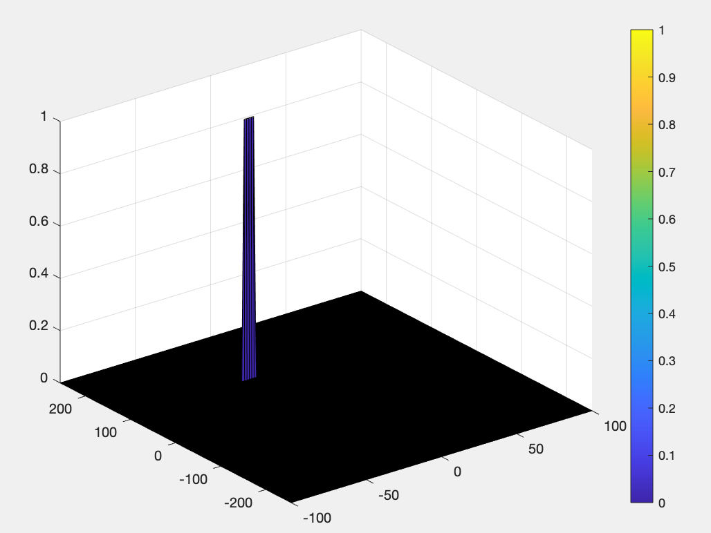
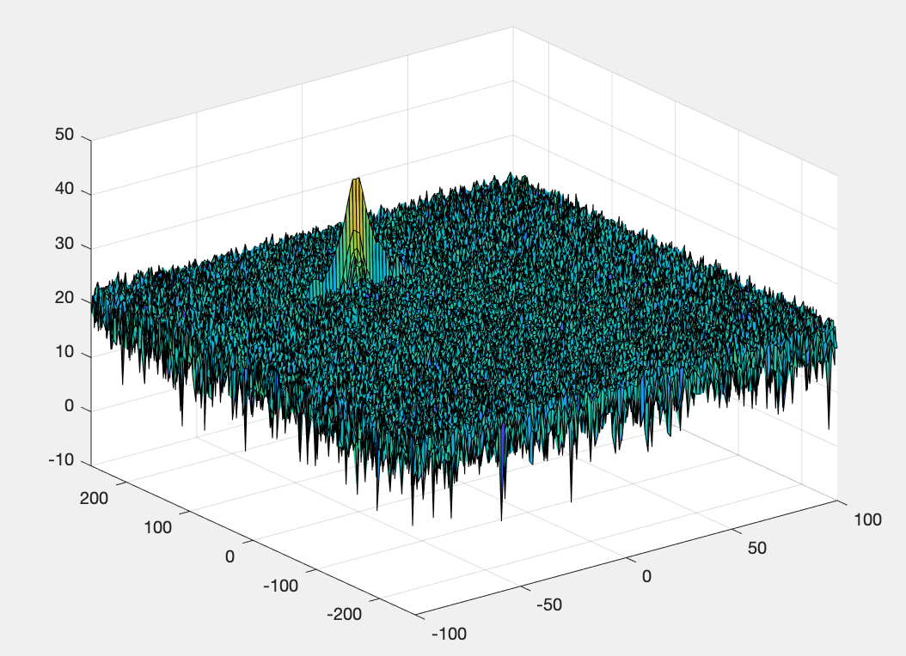
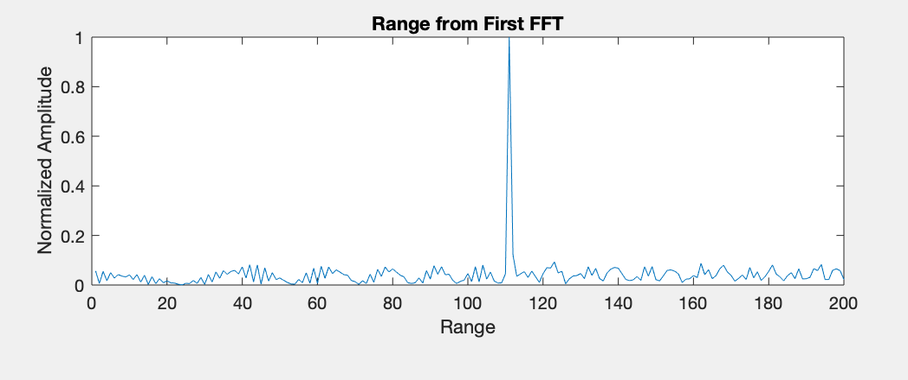

# Radar_Generation_Detection
Implementing RADAR Target generation &amp; Detection in MATLAB

## RADAR Project

### 1.FMCW Waveform Design
```MATLAB
R = 110; %initial distance of the target
v = -20; %speed of the target
fc = 77e9; % Frequency of operation
R_max = 200; % Max Range
resolution = 1; % Range Resolution
c = 3e8; % Speed of Light
v_max = 100; % Max Velocity
%% FMCW Waveform Generation
%Design the FMCW waveform by giving the specs of each of its parameters.
% Calculate the Bandwidth (B), Chirp Time (Tchirp) and slope (slope) of the FMCW
% chirp using the requirements above.
Tchirp = 5.5* 2 * R_max / c;
Bandwidth = c/(2*resolution);
slope = Bandwidth / Tchirp;
```

### 2. Range FFT (1st FFT)<p>
Fourier Transformation 1
```MATLAB
for i=1:length(t)         
    %For each time stamp update the Range of the Target for constant velocity. 
    r_t(i) = R + (v*t(i));
    td(i) = (2*r_t(i))/c;
    %For each time sample we need update the transmitted and
    %received signal. 
    Tx(i) = cos(2 * pi * (fc * t(i) + 0.5 * slope * t(i)^2));
    Rx(i)  = cos(2 * pi * (fc * (t(i) - td(i)) + 0.5 * slope * (t(i) - td(i))^2));
    %Now by mixing the Transmit and Receive generate the beat signal
    %This is done by element wise matrix multiplication of Transmit and
    %Receiver Signal
    Mix(i) = Tx(i)*Rx(i);    
end
%reshape the vector into Nr*Nd array. Nr and Nd here would also define the size of
%Range and Doppler FFT respectively.
Mix = reshape(Mix, [Nr, Nd]);
%run the FFT on the beat signal along the range bins dimension (Nr) and
%normalize.
sig_fft = fft(Mix, Nr);
% Take the absolute value of FFT output
sig_fft = abs(sig_fft);
sig_fft = sig_fft./max(sig_fft); %normalize
% Output of FFT is double sided signal, but we are interested in only one side of the spectrum.
% Hence we throw out half of the samples.
sig_fft= sig_fft(1:Nr/2 - 1);
```
 
### 3. 2D CFAR <p>
Tr is the number of training cells.
Td is the number of training bands.
Gr is the number of guard cells.
Gd is the number of guard bands.
Course provided parameters were used.
```MATLAB
%Select the number of Training Cells in both the dimensions.
Tr = 10;
Td = 8;
% *%TODO* :
%Select the number of Guard Cells in both dimensions around the Cell under 
%test (CUT) for accurate estimation
Gr = 4;
Gd = 4;
% *%TODO* :
% offset the threshold by SNR value in dB
offset = 1.4; 
```
Once we have the 2D CFAR variables ready, we can implement the process.
RDM stands for Range Doppler Map.

```MATLAB
divider = 2*(Td+Gd+1)*2*(Tr+Gr+1)- (Gr*Gd-1);
RDM = RDM/max(RDM(:)); %normalize
   % Use RDM[x,y] as the matrix from the output of 2D FFT for implementing
   % CFAR
for i= Tr+Gr+1:(Nr/2)-(Gr+Tr)
    for j = Td+Gd+1:Nd-(Gd+Td)
        for p = i-(Tr+Gr):i+(Tr+Gr)
            for q = j-(Td+Gd):j+(Td+Gd)
                if (abs(i-p) > Gr || abs(j-q)>Gd)
                    noise_level = noise_level + db2pow(RDM(p,q));
                end
            end
        end
        
     threshold = pow2db(noise_level/divider);
     threshold = threshold+offset;
     CUT = RDM(i,j);
     if (CUT < threshold)
         RDM(i,j) = 0;
     else
         RDM(i,j) = 1;
     end
         
     % cleaning noise_level value
     noise_level = zeros(1,1);
    end
end
```
Finally, we overcome the map size problem using the simple line of code.
```MATLAB
RDM(RDM~=0 & RDM~=1) = 0;
```



